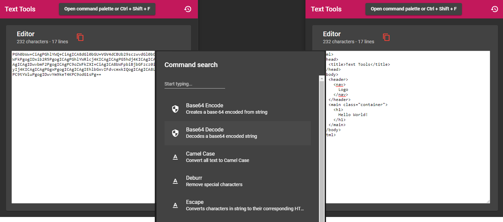

  

<h3 align="center">Text Tools</h3>

  Useful tools to manage your strings quickly.

## Status

## Contributing

To add your scripts
1. Clone this project.
2. Run `npm install` to install the Node.js dependencies.
3. Run `ng g s scripts/<your script name>`.
4. Open the generated service file in your editor, add implements IScript and implement `transform(text: string, parameters?: any[]): string {}` method.
5. Edit `shared/scriptsList.ts` and add your script properties.

## Thanks

Thanks to [Angular](https://angular.io/), [Lodash](https://lodash.com/), [Boop](https://boop.okat.best/) and many other authors for providing the libs, references, knowledge for this project happens.

