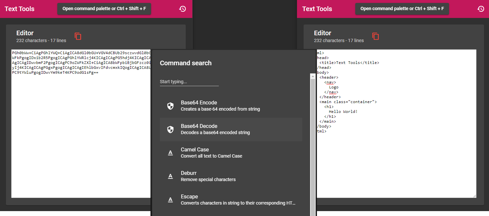

<h1 align="center">Text Tools</h1>

    
   
  <i>Useful tools to manage your strings quickly.</i>
   

  <a href="https://mfcar.github.io/TextTools/"><strong>https://mfcar.github.io/TextTools/</strong></a>
   

  <a href="https://github.com/mfcar/TextTools/issues">Submit an Issue</a>
   
   

  &nbsp;
  &nbsp;
  

## Contributing

Tools are declarative pure functions registered in a central catalog, there are
no services or DI tokens to wire up. To add one:

1. Clone the project and run `npm install`.
2. Add a tool with `defineTool({ ... })` in the matching module under
   `src/app/tools/` (`encoding-tools.ts`, `case-tools.ts`, or `text-tools.ts`).
   Give it an `id`, a `name`, `category`, `icon`, typed `params`, and a
   pure `run(input, params)` that returns the transformed string (or a
   `failure(...)` for invalid input, decoders must never throw).
3. Export it from `src/app/tools/index.ts` so it lands in `ALL_TOOLS` and appears
   in the command palette automatically.
4. Add Vitest unit tests covering normal, empty, edge, and invalid inputs.
5. Run the quality gates before opening a PR:
   `npm run lint`, `npm test`, `npm run e2e`, and `npm run build`.

## Development

- `npm start` — dev server at `http://localhost:4200`.
- `npm test` — unit tests (Vitest).
- `npm run e2e` — end-to-end + accessibility tests (Playwright).
- `npm run build` — production build.

## Thanks

Thanks to [Angular](https://angular.io/), [Boop](https://boop.okat.best/),
[CyberChef](https://gchq.github.io/CyberChef) and many other authors for providing the libs, references, and knowledge that
make this project possible.
